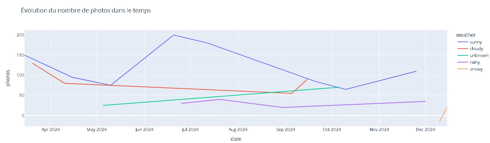

# 🌍 Travel Project

Vous trouverez dans ce repository les différents notebooks et fichiers correspondant au brief **Découverte de Python**.

## 📁 Contenu du projet

- `1_travel_python.ipynb` :  
  Découverte des bases de Python à travers l'analyse de carnets de voyage.

- `2_travel_pandas.ipynb` :  
  Introduction à la bibliothèque **Pandas** pour le traitement d’un fichier CSV (`travel_data.csv`) représentant un carnet de voyage.

- `3_travel_plotly.ipynb` :  
  Création de visualisations interactives à l'aide de **Plotly Express** pour représenter les données analysées.
## 🖼️ Aperçu

Voici un exemple de graphique interactif généré avec Plotly :



## 🛠️ Technologies utilisées

- Python 3
- Jupyter Notebook
- Pandas
- Plotly Express

## 📦 Installation et exécution

1. Clonez le repo :

```bash
git clone https://github.com/ton-utilisateur/travel-project.git
cd travel-project
